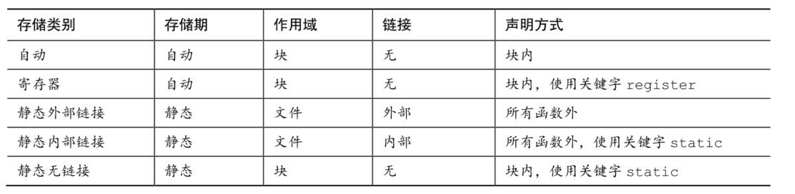

### const char * pc = "Behold a string literal!";
    这是一个常量指针，指向一个字符串字面值。它的值不能被修改，因为它是一个常量。
    由于可以设置pc重新指向其他字符串，所以标识符pc是一个可修改的 左值。const只能保证被pc指向的字符串内容不被修改，但是无法保证pc不指 向别的字符串。

### 函数原型作用域的范围是从形参定义处到原型声明结束。
    编译器在处理函数原型中的形参时只关心它的类型，而形参名(如果有的话)通常无关紧要。而且，即使有形参名，也不必与函数定义中的形参名相匹配。只有在变长数组中，形参名才有用:

    ```C
    void use_a_VLA(int n, int m, ar[n][m]);
    ```
    
    方括号中必须使用在函数原型中已声明的名称。

### 变量的定义在函数的外面，具有文件作用域(file scope)。
    具有文件作 用域的变量，从它的定义处到该定义所在文件的末尾均可见。由于这样的变 量可用于多个函数，所以文件作用域变量也称为全局变量(global variable)。

### 如何知道文件作用域变量是内部链接还是外部链接?
    可以查看外部定义 中是否使用了存储类别说明符static:
    int giants = 5;           // 文件作用域，外部链接 
    static int dodgers = 3;   // 文件作用域，内部链接 
    int main()
    {
        ...
    }
    ...
    该文件和同一程序的其他文件都可以使用变量giants。而变量dodgers属文件私有，该文件中的任意函数都可使用它。

### C对象的4种存储期：静态存储期、自动存储期、动态分配存储期、线程存储期
    1、静态存储期
    如果对象具有静态存储期，那么它在程序的执行期间一直存在。文件作用域变量具有静态存储期。
    对于文件作用域变量，关键字 static 表明了其链接属性，而非存储期。以 static 声明的文件作用域变量具有内部链接。但是无论是内部链接还是外部链接，所有的文件作用域变量都具有静态存储期。
    2、线程存储期
    线程存储期用于并发程序设计，程序执行可被分为多个线程。具有线程存储期的对象，从被声明时到线程结束一直存在。以关键字`_Thread_local`声明一个对象时，每个线程都获得该变量的私有备份。
    3、自动存储期
    块作用域的变量通常都具有自动存储期。当程序进入定义这些变量的块时，为这些变量分配内存;当退出这个块时，释放刚才为变量分配的内存。
    变长数组稍有不同，它们的存储期从声明处到块的末尾，而不是从块的开始处到块的末尾。

    块作用域的变量也能有静态存储期。为了创建这样的变量，要把变量声明在块中，且在声明前面加上关键字 static:

    ```C
    #include <stdio.h> 

    void more(int number);

    int main(void)
    {
        more(10);
        more(20);
        more(30);
        return 0;
    }

    void more(int number)
    {
        int index;
        static int ct = 0;
        ct++;
        printf("ct = %d\n", ct);
    }
    ```

    在这个例子中，变量`ct`的作用域是`more()`函数且声明时带上了 static，因此它具有静态存储期。`more()`函数每次被调用时，`ct`的值都会增加，并打印出来。

     